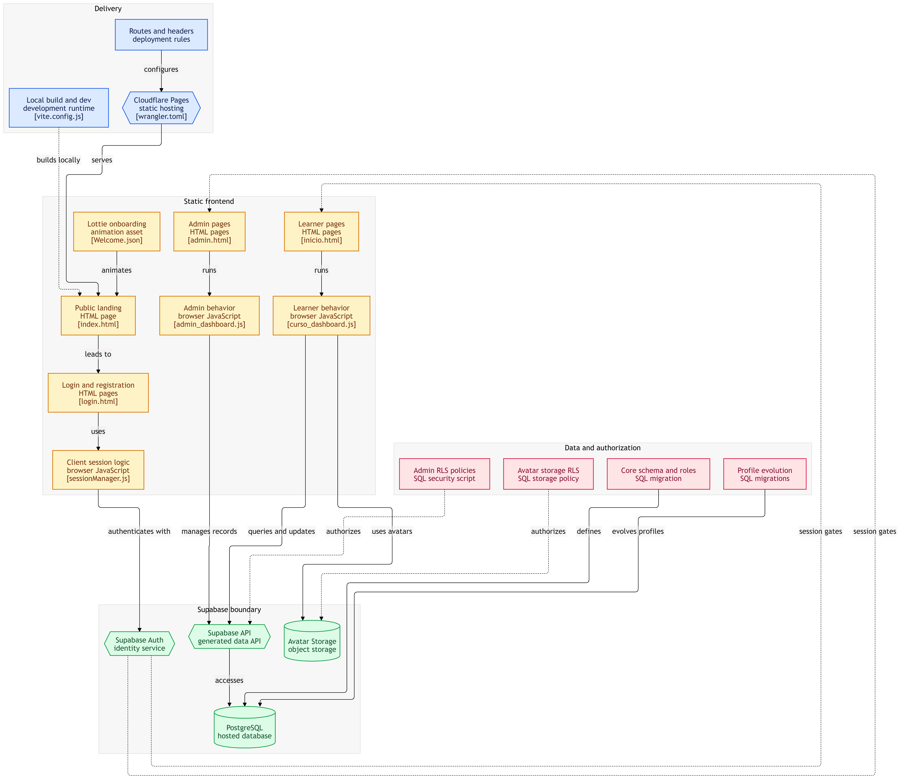

<a href="https://sistema-de-cursos.pages.dev/">

  # English Learning Platform

Una plataforma web para el aprendizaje de inglés.

# Proyecto Eleah - Desarrollo de Software: Plataforma virtual

Plataforma web desarrollada para ELEAH, enfocada en ofrecer cursos de inglés y diferentes recursos digitales para apoyar el aprendizaje de los estudiantes.

El sitio reúne material didáctico, videos, infografías y actividades relacionadas con el aprendizaje del idioma inglés, buscando presentar la información de una manera clara, sencilla y accesible.

  

    

  
## Diagrama de Funciomamiento 

El diagrama representa la arquitectura general del sistema de cursos, mostrando cómo se relacionan sus principales componentes. En la parte de Delivery se muestra el uso de Cloudflare Pages para alojar y desplegar la aplicación, mientras que en el frontend se encuentran las páginas HTML, los archivos JavaScript y los recursos visuales que permiten al usuario interactuar con el sistema. Estos componentes se conectan con Supabase, que se encarga de la autenticación de usuarios, el acceso a la API, la base de datos PostgreSQL y el almacenamiento de archivos, como los avatares. Finalmente, la sección de datos y autorización muestra los archivos SQL utilizados para crear y modificar la estructura de la base de datos, así como las políticas de seguridad RLS que controlan el acceso a la información. En conjunto, el diagrama permite visualizar de manera clara cómo funciona y se organiza el sistema, desde que el usuario entra a la aplicación hasta que se consultan o modifican los datos.

  

  

## Características

- Presentación de la plataforma ELEAH
- Cursos de inglés
- Material didáctico
- Videos educativos
- Infografías
- Actividades de aprendizaje
- Contenido organizado por temas
- Interfaz sencilla y fácil de utilizar
- Diseño adaptable a diferentes dispositivos

## Contenido de la plataforma

### Base de datos y Backend con Supabase

Supabase funciona como un servicio de backend (**Backend-as-a-Service** o **BaaS**), que permite crear aplicaciones web y móviles sin tener que configurar servidores ni construir toda la infraestructura desde cero.

Su núcleo principal está basado en **PostgreSQL**, una potente base de datos relacional que permite trabajar con tablas, relaciones, consultas SQL y diferentes funcionalidades para gestionar la información de una aplicación.

En este proyecto, **Supabase se utiliza como backend y sistema de gestión de datos**, permitiendo conectar la plataforma web con la base de datos y administrar la información de los usuarios y cursos.

### Componentes principales

- **Base de datos PostgreSQL:** Permite almacenar y organizar la información de la plataforma mediante tablas y relaciones.

- **Autenticación:** Permite gestionar el registro, inicio de sesión y acceso de los usuarios.

- **APIs automáticas:** Facilita la comunicación entre la aplicación web y la base de datos.

- **Almacenamiento:** Permite guardar y gestionar imágenes, videos, documentos y otros archivos utilizados en la plataforma.

- **Edge Functions:** Permiten ejecutar código del lado del servidor sin necesidad de administrar servidores físicos.

### ¿Por qué Supabase?

Supabase facilita el desarrollo de la plataforma al proporcionar diferentes servicios de backend en un mismo lugar. Además, al estar basado en PostgreSQL, permite utilizar una estructura de datos relacional y realizar consultas mediante SQL.

> Supabase es una herramienta de código abierto que proporciona servicios de backend para aplicaciones modernas utilizando PostgreSQL como base de datos principal.

La página cuenta con diferentes recursos destinados al aprendizaje del inglés, entre ellos:

### Cursos de inglés

Contenido organizado para que los estudiantes puedan consultar diferentes temas y reforzar sus conocimientos del idioma.

### Material didáctico

Recursos de apoyo utilizados para complementar los temas vistos durante los cursos.

### Videos

Material audiovisual utilizado para explicar temas y facilitar la comprensión de los contenidos.

### Infografías

Recursos visuales que presentan información de manera resumida y fácil de consultar.

## Lenguajes utilizados

<!-- LANGUAGES:START -->

| Lenguaje | Porcentaje |
|:--------:|:----------:|
| **JavaScript** | 41.23% |
| **PLpgSQL** | 23.74% |
| **CSS** | 20.93% |
| **HTML** | 14.11% |

<!-- LANGUAGES:END -->

<!-- LANGUAGES:END -->

<h2 style="font-family: 'Times New Roman', Times, serif;">
  Open Source
</h2>

<a href="https://opensource.com/">

  𝘌𝘴𝘵𝘦 𝘱𝘳𝘰𝘺𝘦𝘤𝘵𝘰 𝘦𝘴 𝘥𝘦 𝘤𝘰𝘥𝘪𝘨𝘰 𝘢𝘣𝘪𝘦𝘳𝘵𝘰 𝘺 𝘧𝘶𝘦 𝘥𝘦𝘴𝘢𝘳𝘳𝘰𝘭𝘭𝘢𝘥𝘰 𝘤𝘰𝘯 𝘧𝘪𝘯𝘦𝘴 𝘦𝘥𝘶𝘤𝘢𝘵𝘪𝘷𝘰𝘴. 𝘗𝘶𝘦𝘥𝘦𝘴 𝘤𝘰𝘯𝘴𝘶𝘭𝘵𝘢𝘳, 𝘮𝘰𝘥𝘪𝘧𝘪𝘤𝘢𝘳 𝘺 𝘤𝘰𝘯𝘵𝘳𝘪𝘣𝘶𝘪𝘳 𝘢𝘭 𝘤𝘰𝘥𝘪𝘨𝘰.

